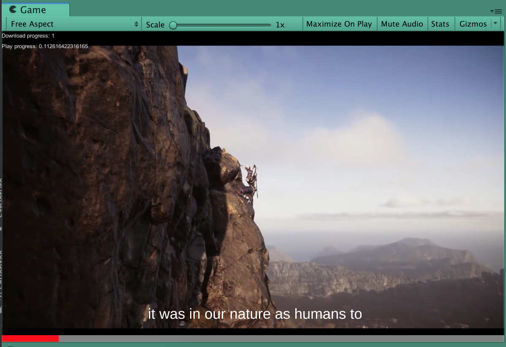

# UnityYoutubePlayer
Play and download youtube videos in Unity using YoutubeExplode and Unity's VideoPlayer.

Uses for handling video and caption downloading.

## Preview

## Usage
- Add a `YoutubePlayer` component on a `GameObject` with a `VideoPlayer`. Set the url in the inspector.
The `YoutubePlayer` will follow the `Play On Awake` setting of the video player. You can also call `YoutubePlayer.PlayVideoAsync`.

- In addition, you can call `YoutubePlayer.DownloadVideoAsync` to download the video to a file instead, with captions in a `.srt` file format. See the `DownloadYoutubeVideo` as an example.

- `VideoPlayerProgress` allows to display the progress of the video, as well as seeking.

- Captions can be downloaded and displayed on a TextMesh Pro component with the `YoutubeCaptions` script.

- See `YoutubePlayer\Scenes\Player` for a complete example, and `YoutubePlayer\Scenes\Panoramic` for playing a 360 video on the skybox.

## Dependencies
UnityYoutubePlayer relies heavily on the work done in [Tyrrrz/YoutubeExplode](https://github.com/Tyrrrz/YoutubeExplode) which is responsible for parsing and downloading videos and captions. 

It's currently being installed through [GlitchEnzo/NuGetForUnity](https://github.com/GlitchEnzo/NuGetForUnity)

In addition, we use `TextMesh Pro` to display captions (but this can be easily swapped to use another kind of text UI)
