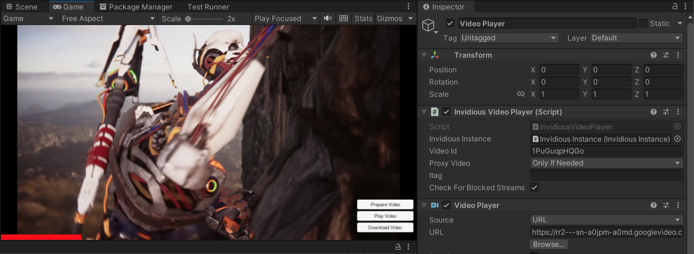

# UnityYoutubePlayer
Play and download youtube videos in Unity using [youtube-dl](https://github.com/ytdl-org/youtube-dl) and Unity's VideoPlayer, and uses [youtube-dl-server](https://github.com/iBicha/youtube-dl-server) to fetch metadata from youtube-dl.

## Preview

## Usage
- Add a `YoutubePlayer` component on a `GameObject` with a `VideoPlayer`. Set the url in the inspector.
The `YoutubePlayer` will follow the `Play On Awake` setting of the video player. You can also call `YoutubePlayer.PlayVideoAsync`.

- In addition, you can call `YoutubePlayer.DownloadVideoAsync` to download the video to a file instead. See the `DownloadYoutubeVideo` as an example.

- `VideoPlayerProgress` allows to display the progress of the video, as well as seeking.

- See `YoutubePlayer\Scenes\Player` for a complete example, and `YoutubePlayer\Scenes\Panoramic` for playing a 360 video on the skybox.

## Dependencies
UnityYoutubePlayer uses [youtube-dl](https://github.com/ytdl-org/youtube-dl) for parsing webpages and getting a raw video url that Unity's VideoPlayer can play.
To allow maximum platform compatibilty (e.g. mobile, desktop) and to be able to update the library without rebuilding the game, we're using [youtube-dl-server](https://github.com/iBicha/youtube-dl-server) web API.

The package uses a free instance of the server hosted on heroku (shared between everyone). 
For better reliability and performance, it is recommanded to host this on your own.
